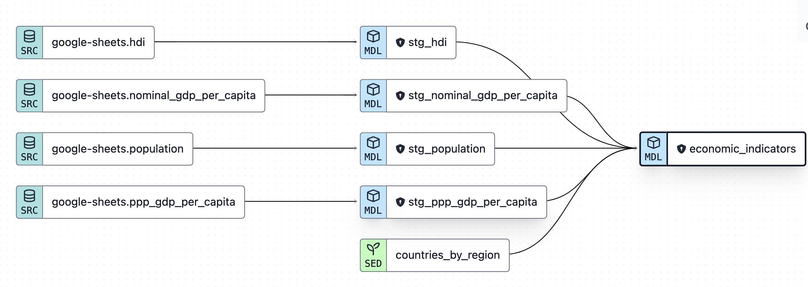

# Economic Indicators Project

[Link to Tableau Dashboard](https://public.tableau.com/app/profile/john.baldwin4618/viz/EconomicIndicators_17029599995600/FinalDashboard?publish=yes)

Welcome to my Economic Indicators project!  This GitHub repository contains the assets for a robust data engineering pipeline that links Wikipedia world economic indicators data to a dashboard displayed on Tableau Public (linked above).  With this project, you can easily sync data from Wikipedia to the dashboard and with it interactively experiment with visualizing economic data in a world map, see what countries are more developed or less developed compared to others, etc.  I'm a huge fan of learning about macroeconomics and international economics, so the project idea came easily to me.

The project is meant to be a demonstration of usage of the Modern Data Stack to develop a user-facing dashboard.  Here are the technologies used and the order in which I used them:

1) Wikipedia data -> Google Sheets via the IMPORTHTML function
2) Prefect for workflow orchestration used to robustly transfer Google Sheets data into a BigQuery data warehouse
3) dbt (data build tool) for data modeling to clean and prepare the data and output into one final table
4) Tableau to take the data from BigQuery and display it in interactive visualizations

This github repository contains the dbt files used in step 3, and folder prefect-files contains the files I used in Prefect.  The source folder in prefect-files contains the original Google Sheets files.  

It was a great experience creating this project, and I'm excited to present the dashboard and the data engineering backend to the community.

dbt lineage graph:

